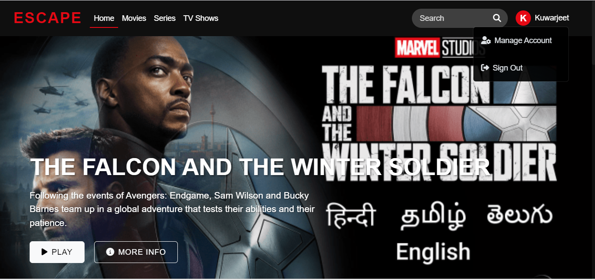
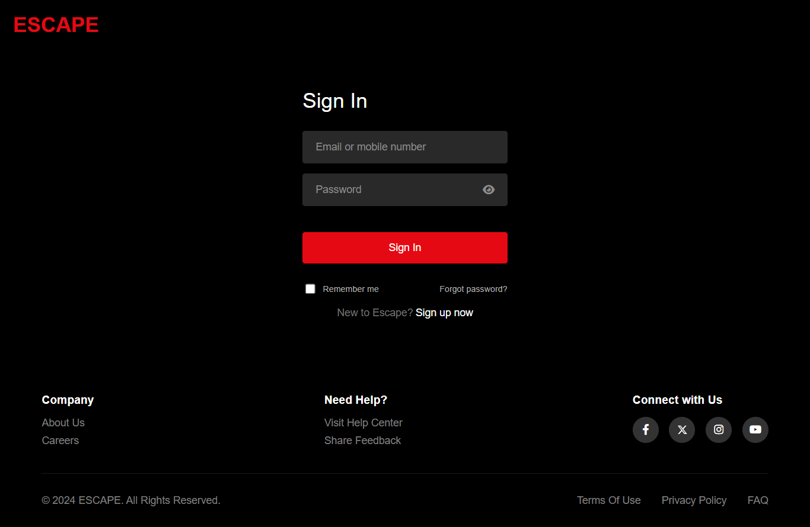
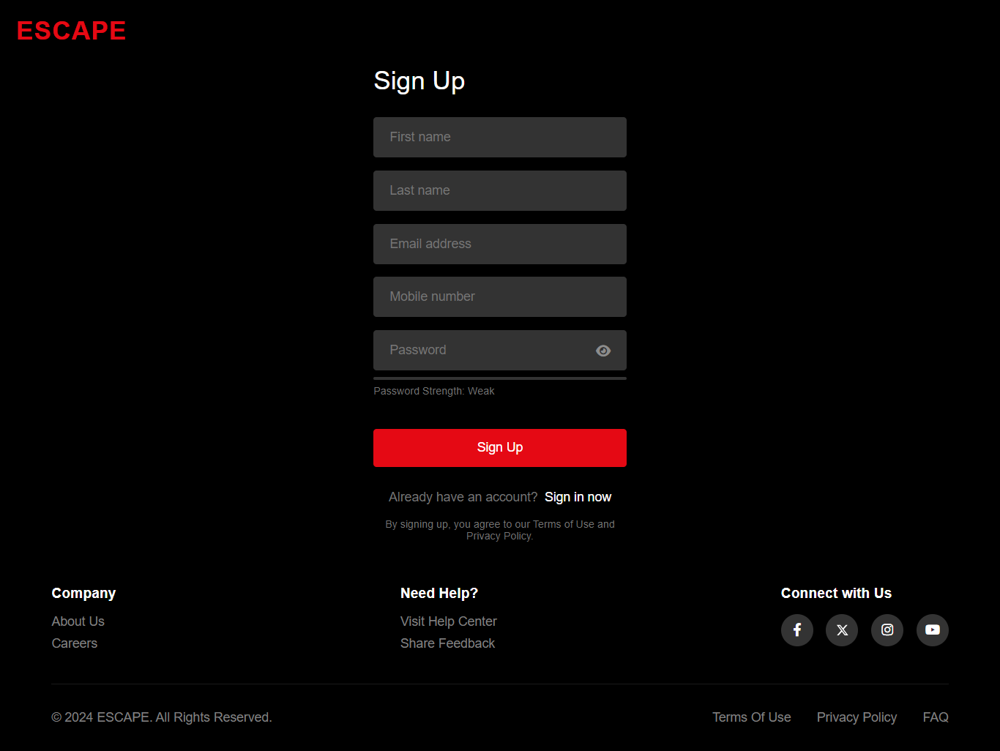
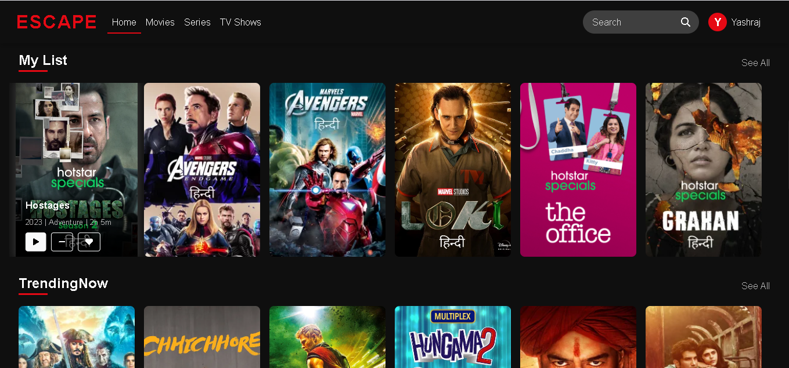
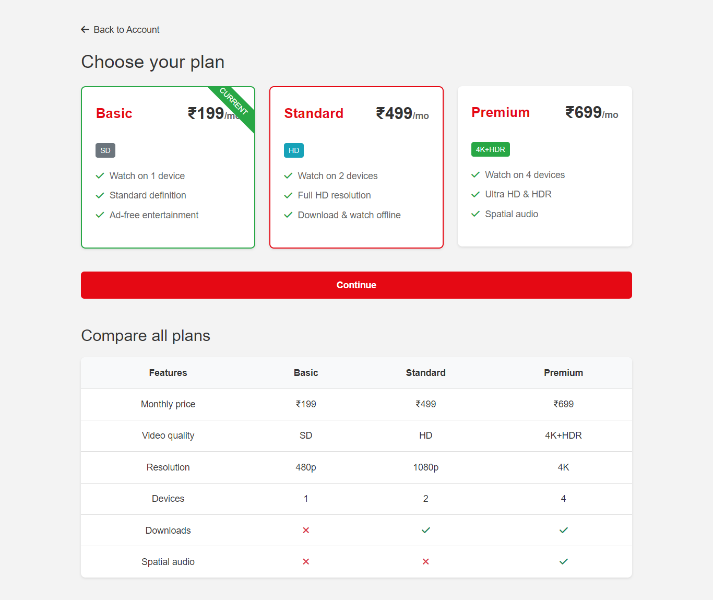
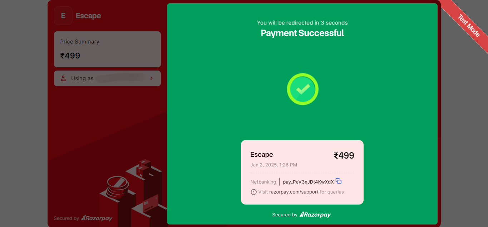
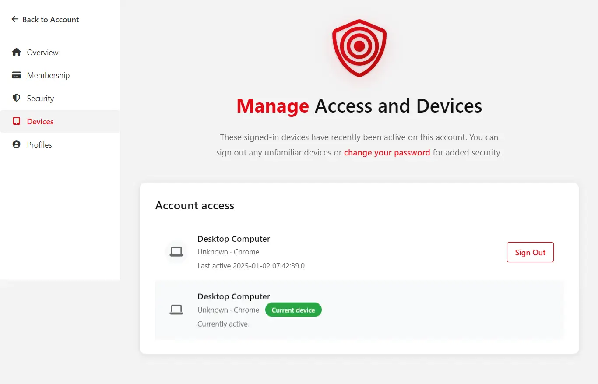
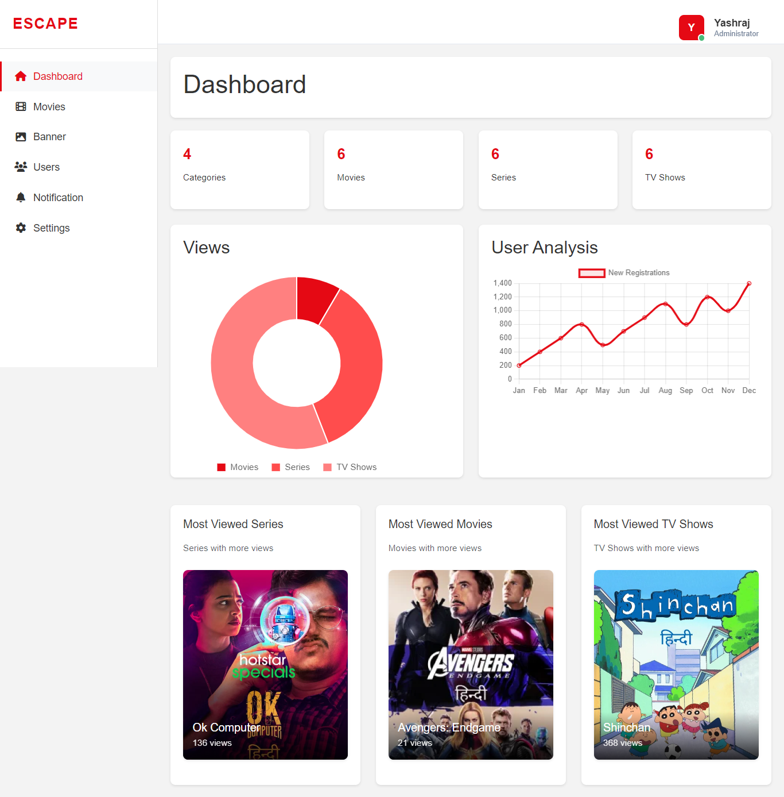
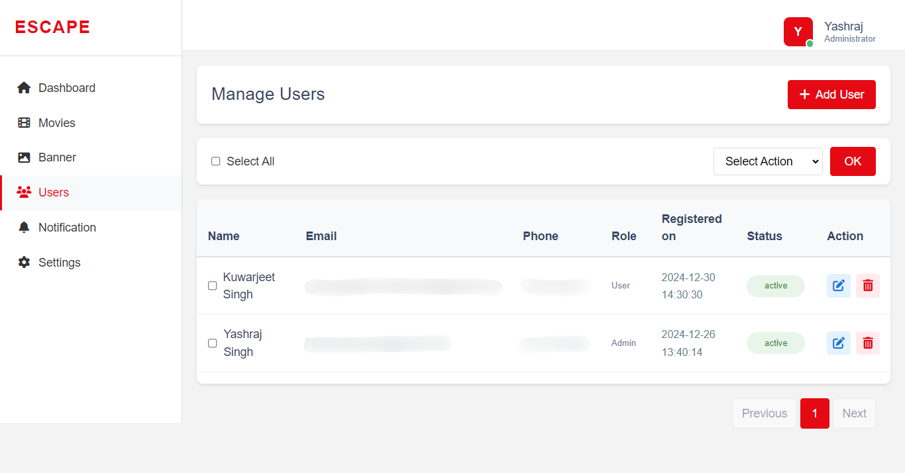
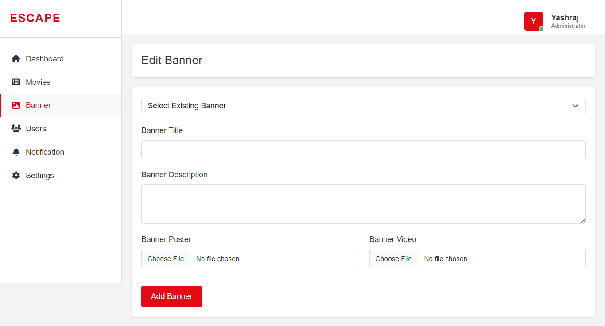

# ESCAPE - OTT Streaming Platform 🎬

Complete OTT (Over-The-Top) streaming platform with video streaming, subscription management, payment processing, multi-device support, and comprehensive admin controls.

[](https://www.oracle.com/java/)
[](https://jakarta.ee/)
[](https://www.mysql.com/)
[](https://razorpay.com/)

## 🚀 Quick Start

### Prerequisites
- Java 17+
- Apache Tomcat 10+
- MySQL 8.0+
- Eclipse IDE

### Installation
```bash
# Clone repository
git clone https://github.com/Yashraj-Coll/escape-ott-platform
cd escape-ott-platform

# Create database
mysql -u root -p
CREATE DATABASE escape_db;
exit;

# Configure database credentials
# Edit: src/main/java/com/escape/util/DatabaseConnection.java

# Import to Eclipse and run on Tomcat server
```

Application will start at: `http://localhost:8080/Escape/`

## 📁 Project Architecture

### Technology Stack
- **Backend:** Java Servlets (JSP/Servlet Architecture)
- **Database:** MySQL 8.0
- **Server:** Apache Tomcat 10+
- **Payment:** Razorpay Integration
- **Email:** Jakarta Mail API

## ✨ Key Features

### 🎥 Video Streaming
- **Multi-Category Content** - Popular Movies, Series, TV Shows, Trending Now
- **Continue Watching** - Resume from where you left off
- **My List** - Personal watchlist management
- **Like/Unlike System** - Rate your favorite content
- **Advanced Search** - Find content quickly
- **View Tracking** - Monitor content popularity

### 💳 Subscription Management
- **Multiple Plans**
  - **Free Plan** - ₹0/month - 1 device, 480p
  - **Basic Plan** - ₹199/month - 1 device, 480p, Full catalog
  - **Standard Plan** - ₹499/month - 2 devices, 1080p
  - **Premium Plan** - ₹699/month - 4 devices, 4K
- **Plan Upgrades/Downgrades** - Seamless plan transitions
- **Subscription History** - Complete transaction tracking
- **Auto-renewal Management** - Automatic billing

### 💰 Payment Integration
- **Razorpay Gateway** - Secure payment processing
- **Multiple Payment Methods**
  - Credit/Debit Cards
  - UPI (Google Pay, PhonePe, Paytm)
  - Net Banking
  - Digital Wallets
- **Transaction Management** - Complete audit trail
- **Payment History** - View all transactions

### 👤 User Management
- **Secure Authentication** - Login/Signup with validation
- **OTP Verification** - Email-based verification
- **Password Reset** - Secure password recovery
- **Profile Management** - Update personal information
- **Session Management** - Secure session handling
- **Activity Logging** - Track user actions

### 📱 Multi-Device Support
- **Device Tracking** - Monitor all logged-in devices
- **Device Management** - View and remove devices
- **Device Limits** - Plan-based restrictions (1-4 devices)
- **Browser Detection** - Chrome, Firefox, Safari, Edge, Brave
- **Device Type Recognition** - Desktop, Mobile, Tablet

### 👨‍💼 Admin Panel
- **User Management** - View, edit, delete users
- **Content Management** - CRUD operations for movies
- **Banner Management** - Homepage slider control
- **Category Management** - Organize content
- **Notification System** - Send emails with movie posters
- **Analytics Dashboard** - User and engagement metrics
- **Payment Tracking** - Monitor transactions

### 📧 Email Notifications
- **Subscription Confirmation** - Automated payment receipts
- **Content Notifications** - New movie alerts with posters
- **OTP Emails** - Verification codes
- **Password Reset** - Recovery emails
- **Transactional Emails** - Payment confirmations

### 🔐 Security Features
- **Login Attempt Logging** - Track failed attempts
- **Device Authentication** - Verify trusted devices
- **Session Security** - HttpOnly cookies
- **SQL Injection Prevention** - Prepared statements
- **Transaction Verification** - Payment validation

## 🛠️ Technology Stack

### Backend
```
Language:          Java 17
Framework:         Jakarta Servlet 6.1
Server:            Apache Tomcat 10+
Database:          MySQL 8.0
```

### Payment & Integration
```
Payment Gateway:   Razorpay Java SDK 1.4.8
Email Service:     Jakarta Mail API 2.0.1
JSON Processing:   Gson 2.8.9
HTTP Client:       OkHttp 4.9.1
```

### Frontend
```
View Technology:   JSP (JavaServer Pages)
Styling:           CSS3
Scripting:         JavaScript
```

## 📦 Setup Instructions

### Step 1: Database Setup
```sql
-- Create database
CREATE DATABASE escape_db;
USE escape_db;

-- Run schema from database_schema.sql
-- Or create tables manually (see documentation)
```

### Step 2: Configure Database

Edit `src/main/java/com/escape/util/DatabaseConnection.java`:
```java
private static final String URL = "jdbc:mysql://localhost:3306/escape_db";
private static final String USER = "your_username";
private static final String PASSWORD = "your_password";
```

### Step 3: Configure Email

Edit email sender classes with Gmail credentials:
```java
private static final String USERNAME = "your_email@gmail.com";
private static final String PASSWORD = "your_app_password";
```

### Step 4: Deploy to Tomcat

#### Using Eclipse:
1. Import project: File → Import → Existing Projects
2. Add Tomcat Server
3. Right-click project → Run As → Run on Server

#### Manual:
```bash
# Copy WAR to Tomcat
cp Escape.war /path/to/tomcat/webapps/

# Start Tomcat
cd /path/to/tomcat/bin
./startup.sh    # Linux/Mac
startup.bat     # Windows
```

## 📚 API Documentation

### Authentication
- `POST /login` - User authentication
- `POST /signup` - User registration
- `POST /logout` - Session termination
- `POST /forgotPassword` - Password reset request
- `POST /verifyOTP` - Verify OTP code
- `POST /resetPassword` - Reset password

### Subscription & Payment
- `POST /processPayment` - Process payment
- `POST /updateSubscription` - Update subscription
- `POST /changePlan` - Change plan

### Movies & Content
- `GET /api/getMoviesByCategory` - Get movies by category
- `GET /api/getMovieDetails` - Get movie info
- `GET /api/searchMovie` - Search content
- `POST /api/updateViews` - Track views

### User Features
- `POST /api/addToMyList` - Add to watchlist
- `POST /api/removeFromMyList` - Remove from list
- `POST /api/likeMovie` - Like/unlike content
- `POST /api/updateContinueWatching` - Update progress

### Admin
- `POST /addBanner` - Add banner
- `POST /sendNotification` - Send notification
- `GET /userManagement` - Manage users

## 💳 Subscription Plans

| Plan | Price | Devices | Quality | Features |
|------|-------|---------|---------|----------|
| **Free** | ₹0 | 1 | 480p | Limited content |
| **Basic** | ₹199/mo | 1 | 480p | Full catalog, No ads |
| **Standard** | ₹499/mo | 2 | 1080p | HD + Download |
| **Premium** | ₹699/mo | 4 | 4K | Ultra HD + All features |

## 📸 Screenshots

### 🏠 Homepage

*Modern landing page with banner carousel and categorized content*

---

### 👤 User Features

#### Login Page

*Secure user authentication*

#### Signup & OTP Verification

*User registration with email verification*

#### Content Browsing

*Browse movies and shows*

#### My List

*Personal watchlist management*

---

### 💳 Subscription

#### Membership Plans

*Choose subscription plan*

#### Payment Processing

*Razorpay payment gateway*

---

### ⚙️ Account Settings

#### Profile Management

*Manage profile and subscription*

#### Device Management

*View and manage devices*

---

### 👨‍💼 Admin Panel

#### Admin Dashboard

*Admin control panel*

#### User Management

*Manage platform users*

#### Banner Management

*Control homepage banners*

---

## 🧪 Testing

### Test Credentials

**Admin:**
```
Email: admin@escape.com
Password: admin123
```

**Test Payment (Razorpay):**
```
Card: 4111 1111 1111 1111
CVV: Any 3 digits
Expiry: Any future date
```

## 🤝 For Recruiters & Engineers

### Quick Demo
1. Clone repository
2. Setup MySQL database
3. Configure credentials
4. Deploy to Tomcat
5. Access at `http://localhost:8080/Escape/`

### Project Highlights
- **Built:** BCA final year project at Techno Main Salt Lake, Kolkata (2024-2025)
- **Problem Solved:** Netflix-like streaming with subscription management
- **Architecture:** MVC pattern with Servlet/JSP
- **Scale:** Multiple users, devices, payments, content delivery

### Technical Decisions
- **Java Servlets:** Direct control, core Java EE understanding
- **JDBC:** Fine-grained SQL control, optimized queries
- **Session-based Auth:** Simple, effective for monolithic architecture
- **Razorpay:** Best gateway for Indian market with UPI

## 🐛 Known Issues & Roadmap

### Current Limitations
- Video upload via admin panel not implemented
- Basic search functionality
- Email may go to spam folder

### Planned Features
- [ ] Video upload system
- [ ] Advanced search with filters
- [ ] User reviews and ratings
- [ ] AI-powered recommendations
- [ ] Mobile applications
- [ ] Chromecast support

## 👨‍💻 Developer

**Yashraj**
- **Education:** BCA Graduate, Techno Main Salt Lake (2025)
- **LinkedIn:** https://linkedin.com/in/yashraj-singh-dev
- **Email:** yashrajsingh.mail@gmail.com
- **Portfolio:** 

### Other Projects
- **MediConnect** - AI Healthcare Platform
  - [Main Docs](https://github.com/Yashraj-Coll/mediconnect)
  - [Backend](https://github.com/Yashraj-Coll/mediconnect-backend)
  - [Frontend](https://github.com/Yashraj-Coll/mediconnect-frontend)

## 📄 License

This project is licensed under the MIT License - see the LICENSE file for details.

## 🙏 Acknowledgments

- Jakarta EE Community
- Razorpay for payment integration
- Techno Main Salt Lake faculty

---

**⭐ If you find this project interesting, please star the repository!**